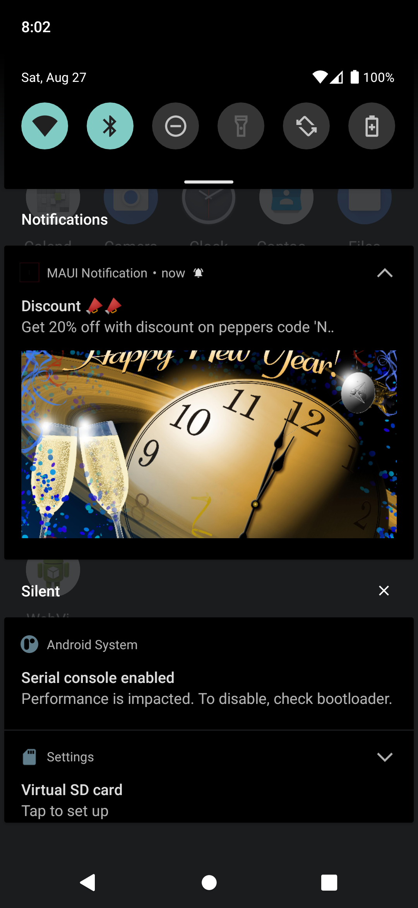
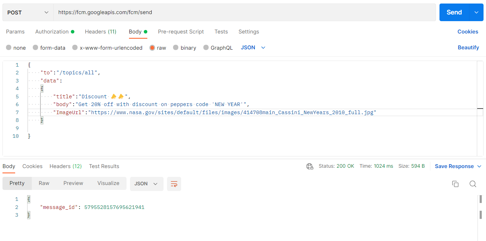

# Push MAUI Notify
Firebase push notification with json payload. Implementation on MAUI Android to display notification with tile, body and Image.

# Setup
* Install following nuget package inside MAUI Android Project
  * Xamarin.Firebase.Messaging
* Get server key from firebase console and download google-services.json file
* Place goole-services.json inside android project and set build action to GoogleServices.Json. You can set build action with <GoogleServicesJson  Include="Platforms\Android\google-services.json" /> on csproj file.

# Learn More 
Link: https://docs.microsoft.com/en-us/xamarin/android/data-cloud/google-messaging/remote-notifications-with-fcm?tabs=windows

# Generate Notification icon 
Link: https://romannurik.github.io/AndroidAssetStudio/icons-notification.html#source.type=clipart&source.clipart=ac_unit&source.space.trim=1&source.space.pad=0&name=ic_stat_ac_unit

# Notification payload format

    public class NotificationPayload
    {
        [JsonProperty("to")]
        public string To { get; set; }

        [JsonProperty("data")]
        public Data Datas { get; set; }
    }
    public class Data
    {
        [JsonProperty("title")]
        public string Title { get; set; }

        [JsonProperty("body")]
        public string Body { get; set; }

        [JsonProperty("ImageUrl")]
        public string ImageUrl { get; set; }
    }
    
  You can import postman_collection.json to postman and push Firebase Notification. Make sure you replace header key with your server key.
  
  # Notification payload example
    {
      "to":"/topics/all",
      "data":
      {
          "title":"Discount 📣📣",
          "body":"Get 20% off with discount on peppers code 'NEW YEAR'",
          "ImageUrl":"https://www.nasa.gov/sites/default/files/images/414708main_Cassini_NewYears_2010_full.jpg"
      }
    }
  
  Make sure you create your notification channel and suscribe to the topic that you are using in your payload 'to' parameter. If you want to notify specific user, replace topic with user's firebase id.  
  Subscribe Notification ` FirebaseMessaging.Instance.SubscribeToTopic("all");`  
  For more details refer the repo code above.
  
 # Notification Preview
   
    
 
